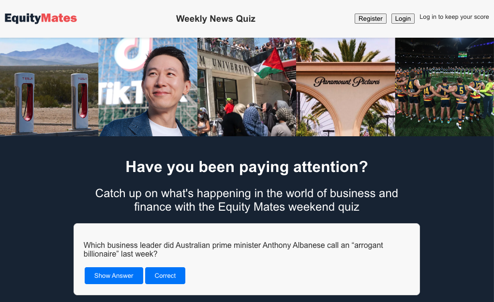
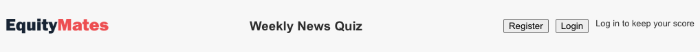
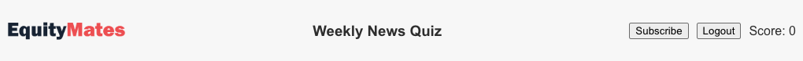
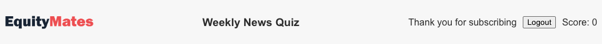

# super-lamp
A website for the Equity Mates weekend quiz

## Description

This application is the website and backend server for the Equity Mates weekend quiz. 

Every Saturday, users are able to test their knowledge and catch up on the news of the week through the fun and engaging quiz. 

Up until now, the quiz has only lived on social media. Now anyone can access the quiz through this website. 

What's more, avid users can subscribe for additional questions each week. 

## Table of Contents 

- [Installation](#installation)
- [Usage](#usage)
- [Credits](#credits)
- [License](#license)

## Installation

To install the project, download the repository from GitHub: https://github.com/a-r3n/super-lamp

To run the application on your local machine, open the integrated terminal and run "NPM RUN BUILD" and then "NPM RUN START" 

The frontend application will be accessible at http://localhost:3000/

Meanwhile, the server can be queried at http://localhost:4000/graphql

## Usage

To use the website, visit the deployed application at https://super-lamp.onrender.com/

Users will land on this page:

There are 3 states for the website:
1. Logged out
2. Logged in & not subscribed
3. Logged in & subscribed

Below is a screenshot of the header in each state. 

1. Logged out

2. Logged in & not subscribed

3. Logged in & subscribed

When a user logs in, they can keep their score. 
When a user is logged in and subscribed they will get access to subscriber-only questions. 

## Credits

Thank you to the Sydney University Coding Bootcamp instructor team for their help over the past six months. This wouldn't have been possible without your instruction. 

This application has been built with a number of open source and freely available technologies and third-party libraries including React, Express.js, and Node.js. Thank you to all those who have contributed to these projects.

## License

This application has been build under an MIT License. 

For more information on the license conditions and terms of use, please refer to the LICENSE document that can be found in this project's GitHub repository: https://github.com/a-r3n/super-lamp